# Publishing tutorials to "Production"

The steps for publishing a new tutorial or an updated tutorial to the production environment are described below.

---

## 1 One-time setup for production repository
1. Log into your Github account

2. Navigate to the production repository web page <https://github.com/SAPDocuments/Tutorials>

3. Click on the **Fork** button.

 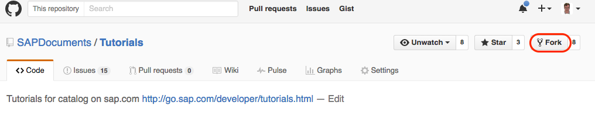

4. In the dialog box, select your user.

 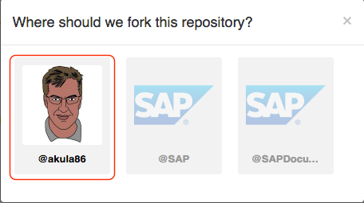

5. The web page updates to show that the production repository has been forked to your account. Next, click on the **Clone** button.

 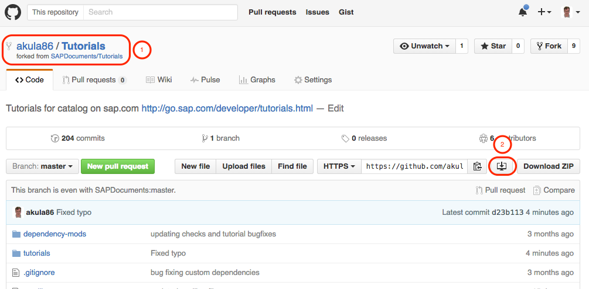


6. In desktop, select folder on your local machine where the tutorials will be saved and click **Clone**.

 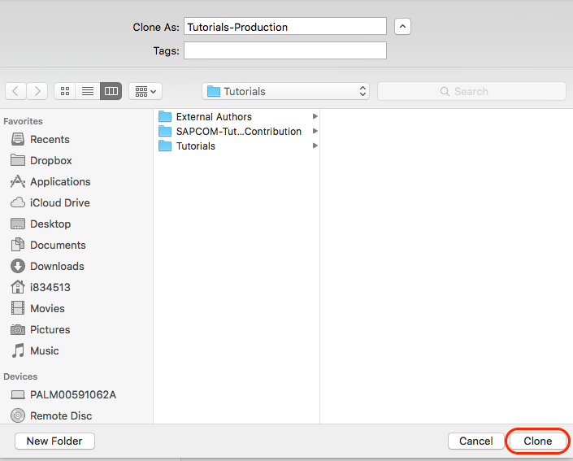

7. The client will the synchronize (download the files) to your local machine.

 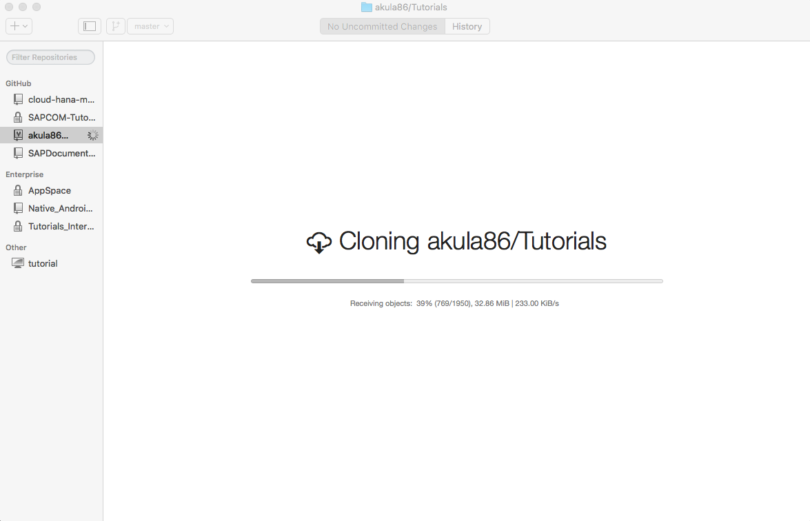

8. When complete, the desktop client will show the **History** of commits, and also that you have **No Uncommitted Changes**.

 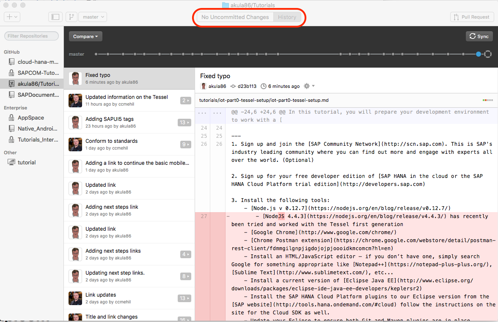
 
9. Go to the Contributor's License Agreement [(CLA) assistant](https://cla-assistant.io) and select the SAP CLA and link it to the `Your-Account/Tutorials` repository (just follow the prompts).

10.  

## 2 Moving the finished tutorial(s) to the production folder

1. **Mandatory:** In the Github desktop client, click the **Sync** button to ensure you have an updated local version of the repository in your fork. If you do not, you will likely get errors when you commit and create the pull request later.

2. Copy your **entire tutorial folder(s)** to the production tutorials folder on your local machine(depending on how you named the folder, the path will be something like `Tutorials/tutorials`. The local version of the folder will look something like this on your machine (one of the folders below will be what you have copied over):

 ```bash
 [~/dev/Tutorials/Tutorials/tutorials $ ll
 total 0
 drwxr-xr-x  38 i834513  GLOBAL\Domain Users  1292 Mar  8 16:07 hana-configure/
 drwxr-xr-x  11 i834513  GLOBAL\Domain Users   374 Mar  8 16:07 hana-setup-cloud/
 drwxr-xr-x   7 i834513  GLOBAL\Domain Users   238 Mar 30 09:18 hcp-create-destination/
 drwxr-xr-x  11 i834513  GLOBAL\Domain Users   374 Mar 16 20:13 hcp-create-trial-account/
 drwxr-xr-x  11 i834513  GLOBAL\Domain Users   374 Mar 16 20:13 hcp-deploy-mobile-web-app/
 drwxr-xr-x  11 i834513  GLOBAL\Domain Users   374 Mar 16 20:13 hcp-java-weatherapp-part1/
 drwxr-xr-x   7 i834513  GLOBAL\Domain Users   238 Mar 16 20:13 hcp-java-weatherapp-part2/
 drwxr-xr-x   7 i834513  GLOBAL\Domain Users   238 Mar 16 20:13 hcp-java-weatherapp-part3/
 drwxr-xr-x   6 i834513  GLOBAL\Domain Users   204 Mar 16 20:13 hcp-java-weatherapp-part4/
 drwxr-xr-x   9 i834513  GLOBAL\Domain Users   306 Mar 16 20:13 hcp-java-weatherapp-part5/
 drwxr-xr-x  16 i834513  GLOBAL\Domain Users   544 Mar 16 20:13 hcp-java-weatherapp-part6/
 drwxr-xr-x   6 i834513  GLOBAL\Domain Users   204 Mar 16 20:13 hcp-java-weatherapp-part7/
 drwxr-xr-x  10 i834513  GLOBAL\Domain Users   340 Mar 16 20:13 hcp-java-weatherapp-part8/
 drwxr-xr-x   5 i834513  GLOBAL\Domain Users   170 Mar 24 12:47 hcp-java-weatherapp-part9/
 drwxr-xr-x   7 i834513  GLOBAL\Domain Users   238 Mar 24 12:54 hcp-webide-labels-i18n/
 drwxr-xr-x  33 i834513  GLOBAL\Domain Users  1122 Mar 25 18:56 hcp-webide-localizing-app/
 drwxr-xr-x  26 i834513  GLOBAL\Domain Users   884 Mar 29 16:04 hcp-webide-odata-primer/
 drwxr-xr-x   8 i834513  GLOBAL\Domain Users   272 Mar 23 10:02 hcp-webide-round-currency/
 ~/dev/Tutorials/Tutorials/tutorials $
 ```

3. The desktop client will show that you have uncommitted changes.

 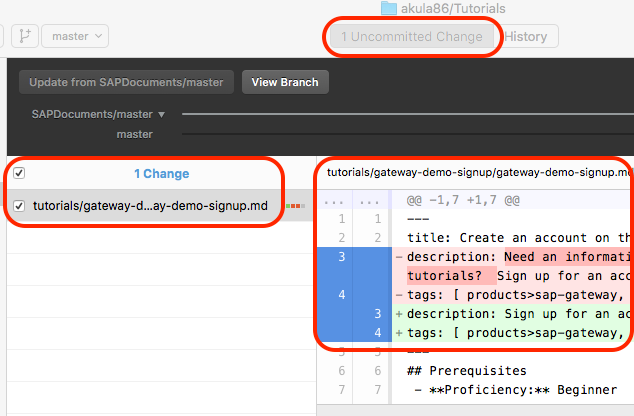

3. **Mandatory:** Run the `node test.js` command again in the production repository to confirm the checks pass. The only expected errors will be any additions needed for the `.spelling` file in production.

4. Update the prerequisite and Next Steps links in your tutorial as applicable.


## 3 Commit to your fork, trigger a pull request

1. In the Github Desktop client, check the files you want to commit, fill in the **Summary** and **Description** fields in the client, then click the **Commit to master** button. It is required to enter the Summary, and important to enter the description so the Publisher knows what changes to validate.

 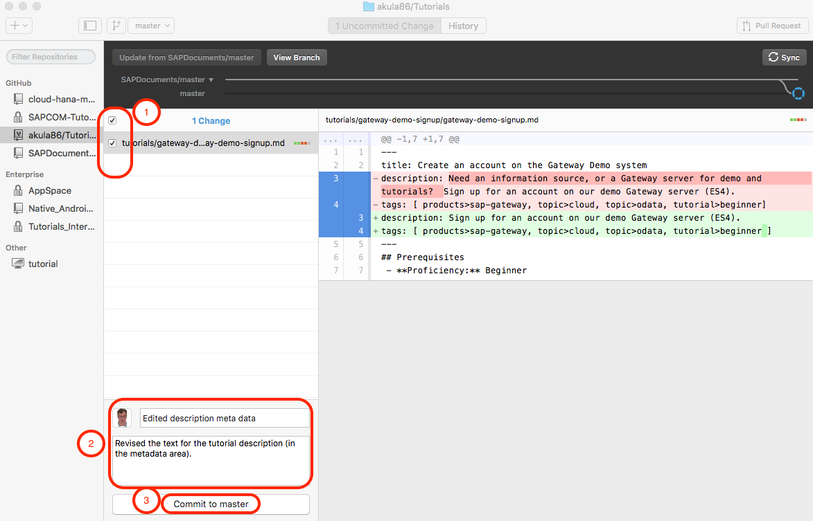

2. In the Github Desktop client, click the **Pull Request** button. See the [Github site](https://help.github.com/articles/creating-a-pull-request/) for more background on pull requests.


 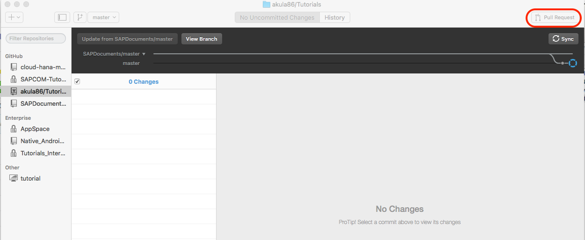

3. The Pull Request pane opens and is pre-populated based on the information you entered in the commit. Click the **Send Pull Request** button.

 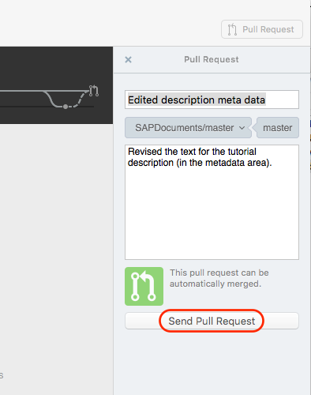

4. The confirmation message is displayed.

 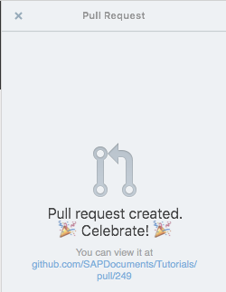

5. You can confirm that the pull request was created by visiting the [repository](https://github.com/SAPDocuments/Tutorials/pulls) web page and selecting your pull request.

 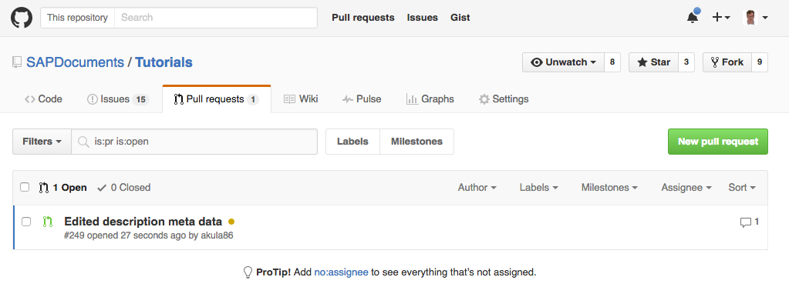

6. Update the [`tutorial-grouping.md`](tutorial-grouping.md) file with your group name, tutorial titles and link to the URL in production.

## 4 Publisher reviews pull request
**This section is only applicable to those in the Publisher role.**

1. When a pull request is created in your area, or assigned to you, click on the pull request to view it.

 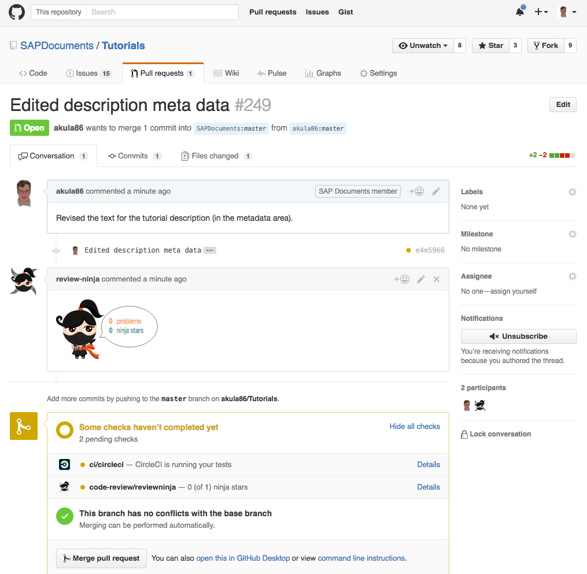

2. Click on the **Files changed** tab to see the changes.

 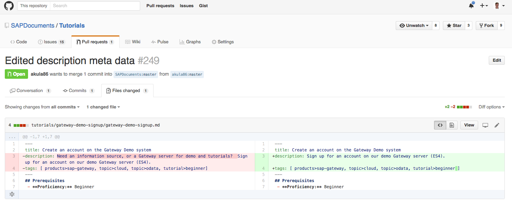

3. Go back to the conversation view and click on **Merge pull request**.

 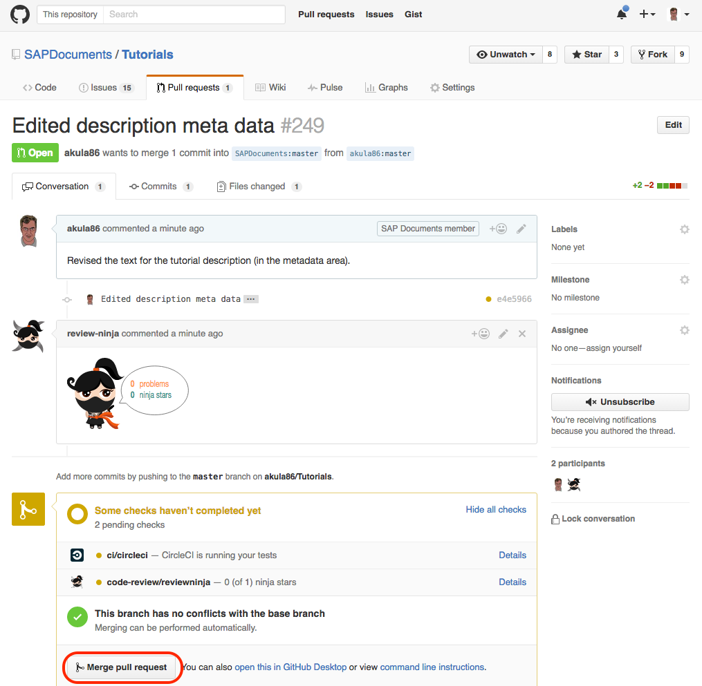

4. Log into ReviewNinja with your Github account, confirm the edits and click the Merge pull request button to merge the pull request into the main branch in the production repository.

 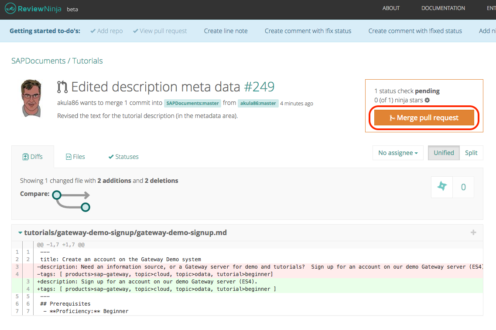

## 5 Page available in production
**This section is only applicable to those in the Publisher role.**

1. One the merge is complete, the CircleCI build process will kick off and report status in a button. If you see a green PASSED button, then all is well.

 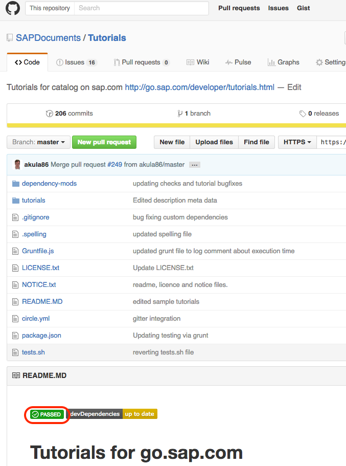

2. When a set of tutorials are being added and contain links to each other - the tests will fail because the link checker will attempt to load pages that have not yet been created. Click on the red FAILED button to open the CircleCI page (log in with your Github account).

3. Click on the red failed tag (it will be on the top if the build has just been broken) to see the details of that CI run.

 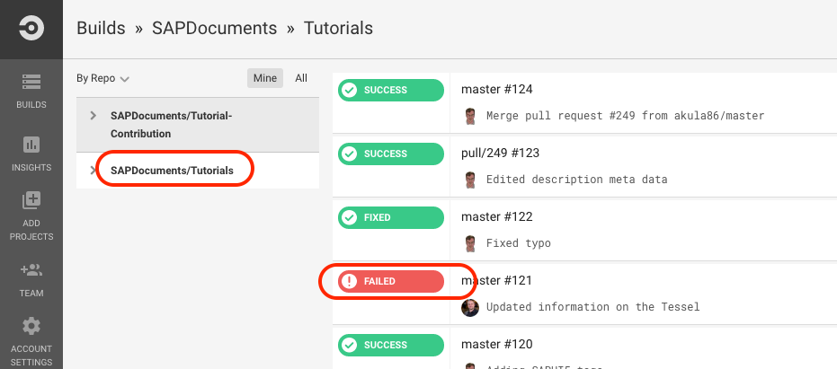

4. Scroll to the bottom of the window to see the errors logged.

 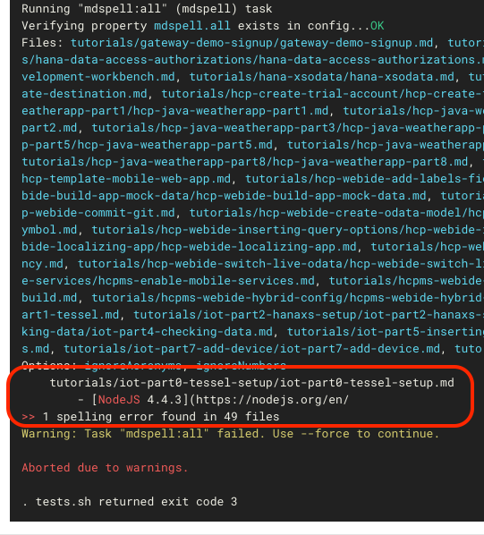

5. If it is a simple fix, you may correct it for the author, or create an issue in Github, assign it to the author for them to make the correction.

6. On the hour and every 15 min, the automated HTML page generation process will start and will create HTML pages for any new `.md` files pushed or merged since it last ran. After that, the tutorial will be visible in the [tutorial catalog](http://go.sap.com/developer/tutorials.html).
